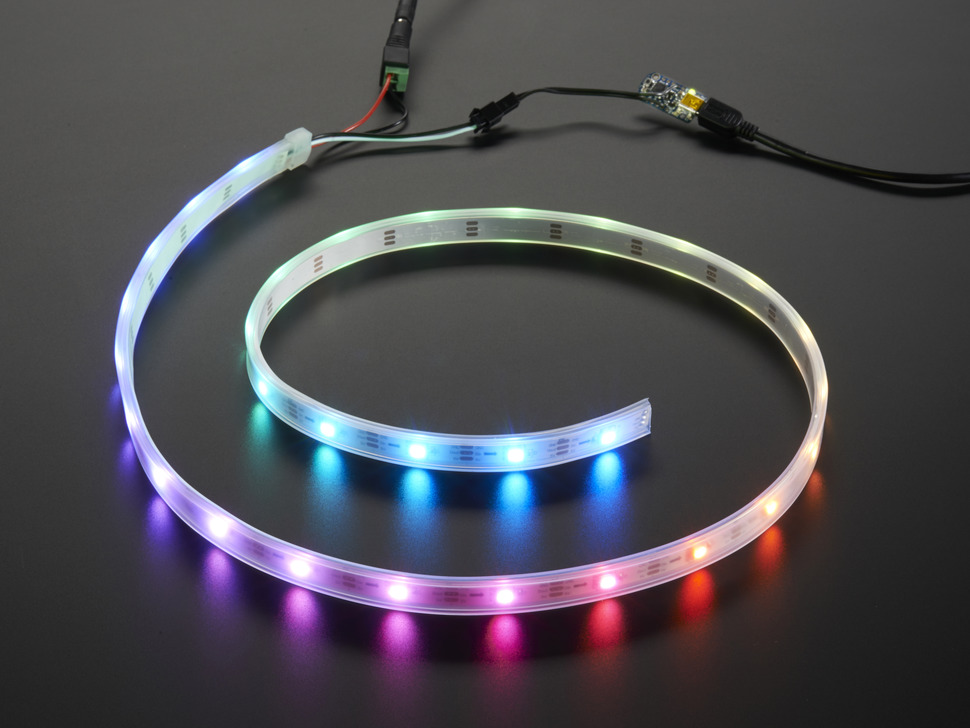

## Componentes: Ring, Meter
### Por: Robledo Sanchez Damian 19211719

Los LED NeoPixel representan la primera forma de "DIY" ampliamente disponible de LED RGB digitales con bibliotecas y contenido de soporte para que sean utilizables para proyectos personales. Desde un solo pin puedes controlar (teóricamente) tantos LEDs como quieras, sin embargo, hay algunas limitaciones.

Debes tener cuidado al usar los LED RGB porque consumen mucha energía. Si intenta alimentar más de un par de pines de 5 V por parte de su microcontrolador, lo más probable es que se freira la placa. Utilice una fuente de alimentación de 5 V separada que pueda manejar el consumo de corriente total.
