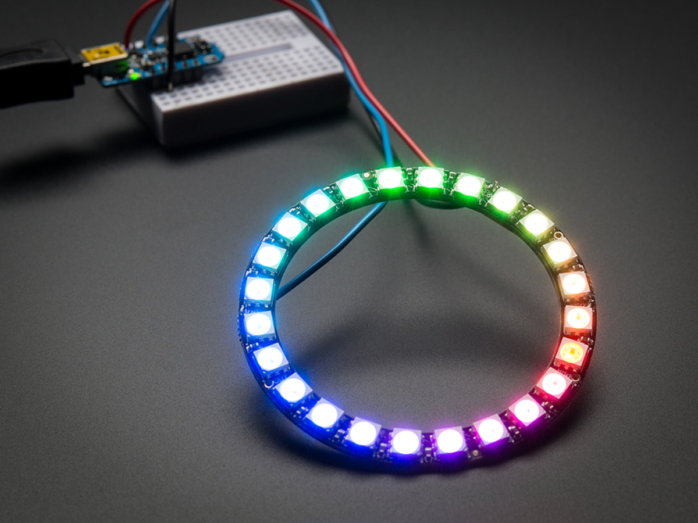
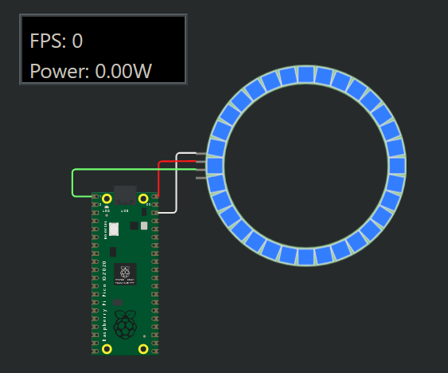

## Componentes: Ring, Meter
### Por: Robledo Sanchez Damian 19211719

## ¿Qué es el NeoPixel Ring?
Los LED NeoPixel representan la primera forma de "DIY" ampliamente disponible de LED RGB digitales con bibliotecas y contenido de soporte para que sean utilizables para proyectos personales. Desde un solo pin puedes controlar (teóricamente) tantos LEDs como quieras, sin embargo, hay algunas limitaciones.

Debes tener cuidado al usar los LED RGB porque consumen mucha energía. Si intenta alimentar más de un par de pines de 5 V por parte de su microcontrolador, lo más probable es que se freira la placa. Utilice una fuente de alimentación de 5 V separada que pueda manejar el consumo de corriente total.

Estos son LED controlables individualmente, todos alojados en una cadena que se puede controlar desde un solo pin en un microcontrolador. Esto significa que un pin puede controlar todos los colores de los LED y qué LED están encendidos en un momento dado. En comparación con un LED RGB normal, notará que necesitamos 3 pines para controlar el valor Rojo Verde y Azul y todos los LED deben permanecer encendidos o apagados. Entonces, como puede ver, el uso de direccionable individualmente puede ayudar a crear algunos efectos geniales.

https://wokwi.com/projects/342722793449718356

